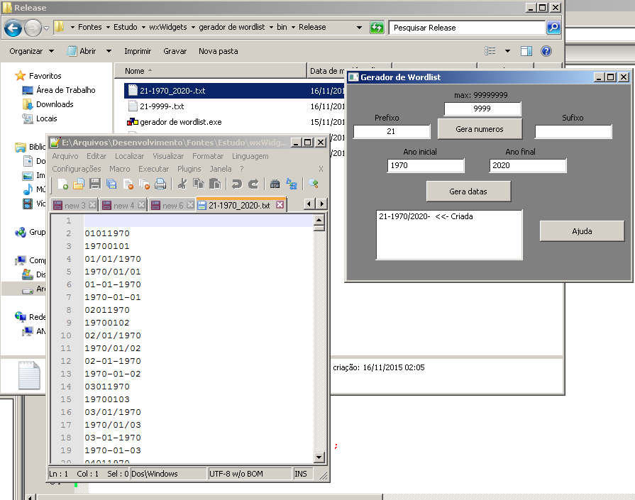

# gera_wordlist
Gerador de wordlist feito em C + Wxwidgets

Ferramentas utilizadas:

CodeBlocks 13.12 + plugin wxSmith      -      http://www.codeblocks.org/downloads

wxWidgets 3.0   -    https://www.wxwidgets.org/news/2014/10/wxwidgets-3.0.2-released/ 

